# Architecture Overview

High-level view of how a request flows through the system, from the client to
MySQL and back — including the real-time path via GraphQL subscriptions.

## Key points

- **Single Express app, two transports.** The same `context()` factory builds
  the per-request `dataSources` object for both the HTTP path (queries/mutations)
  and the WebSocket path (subscriptions) — the only difference is that WS
  connections skip `LoginApi` (`connection: true`), since login/logout only
  make sense over HTTP with cookies.
- **Stateful JWT.** Tokens aren't just verified cryptographically — `context()`
  also checks the token against the one stored on the user's row
  (`user.token !== token` invalidates it), so logout truly revokes a session
  instead of just deleting a client-side cookie.
- **DataLoader batching.** Every `*SQLDataSource` extends the generic
  `SQLDatasource<TKey, TValue>` base class, which wraps a `DataLoader` per
  access pattern (`batchLoadById`, `batchLoadByUserId`, `batchLoad` by
  `post_id`) — see [`datasources-class-diagram.md`](./datasources-class-diagram.md).
- **PubSub swaps transparently.** `createPubSub()` returns a Redis-backed
  `PubSubEngine` when `REDIS_URL` is set (required in production) and falls
  back to the in-memory `PubSub` otherwise — resolvers never know which one
  they're talking to.
- **Kafka is an optional event backbone in front of PubSub.** `CommentSQLDataSource.create()`
  never touches PubSub directly — it calls `publishCommentCreated()`
  (`src/kafka/producer.ts`). When `KAFKA_BROKERS` is set, that publishes onto
  the `comment.created` topic, and a separate consumer group
  (`src/kafka/consumer.ts`, started at boot) reads it back and republishes
  onto PubSub. When `KAFKA_BROKERS` is unset, the producer publishes to
  PubSub directly — same event, no broker required. Either way, the
  `createdComment` subscription resolver is unaware Kafka exists. See
  [`subscriptions-flow.md`](./subscriptions-flow.md).
- **Defense in depth.** Query depth is capped at 7 (`graphql-depth-limit`),
  introspection is disabled outside development, and every mutation that
  touches a specific user's data re-checks ownership (`checkOwner`) even
  though the caller is already authenticated.
