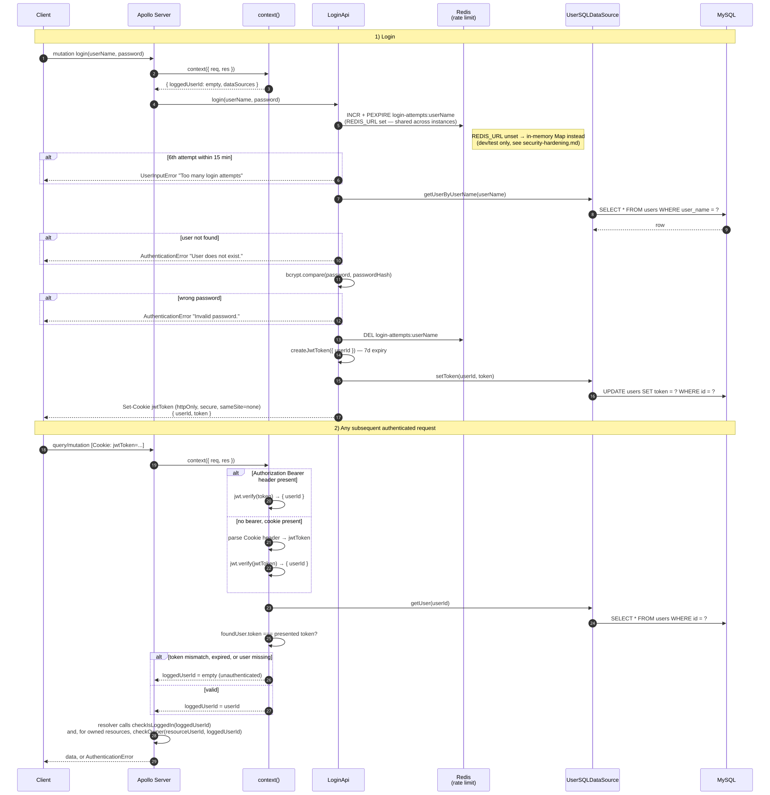

# Authentication &amp; Authorization Flow

Two sequences: logging in (issuing a session), and how every subsequent
request is authenticated against it.

## Why the token is checked against the database

A JWT with a valid signature is normally *sufficient* proof of identity.
Here it isn't: `context()` additionally requires `foundUser.token === token`.
That's what makes **logout an actual revocation** — `LoginApi.logout()` clears
`users.token`, so the previously-issued JWT keeps a valid signature but stops
authenticating anything, even before its 7-day expiry. The trade-off is one
extra `SELECT` per authenticated request, in exchange for real server-side
session control.

## Rate limiting is Redis-backed, not per-process

`checkRateLimit`/`clearRateLimit` (step 4 above) use Redis when
`REDIS_URL` is set — which it already must be in production, for PubSub —
falling back to an in-memory `Map` only in dev/test. This matters the
moment there's more than one instance: a per-process counter lets a
brute-force client get a multiple of the intended 5-attempts-per-15-minutes
budget just by landing on different pods. See
[`security-hardening.md`](./security-hardening.md) for how this was found
(the [Kubernetes manifests](../k8s/README.md) run `replicas: 2`) and
verified against a real Redis instance.

## Two authorization primitives, used differently per resolver

- **`checkIsLoggedIn(loggedUserId)`** — "is anyone logged in at all?" Used by
  resolvers that only require *some* authenticated user (e.g. `posts`,
  `createComment`).
- **`checkOwner(resourceUserId, loggedUserId)`** — calls `checkIsLoggedIn`
  first, then additionally requires `loggedUserId === resourceUserId`. Used
  wherever a mutation must be restricted to the resource's own owner
  (`updateUser`, `deleteUser`; `updatePost`/`deletePost` apply the same idea
  inline against the post's `userId`).

See [`login-functions.ts`](../src/graphql/schema/login/utils/login-functions.ts)
and its tests for the exact rules, and
[`context.test.ts`](../src/__tests__/context.test.ts) for every
authentication branch (Bearer token, cookie, mismatched token, expired/invalid
JWT, missing headers).
