# Database Scaling

How connection pooling and the optional read replica work, and why the split
between them is drawn where it is.

## Connection pool

`src/knex/knexfile.ts` sizes the pool from `DATABASE_POOL_MIN` /
`DATABASE_POOL_MAX` (defaults: 2 / 10, unchanged from before these were
configurable). Raise `DATABASE_POOL_MAX` before scaling instance count
horizontally — a pool that's too small under concurrent load surfaces as
requests queuing for a connection, not as a MySQL error.

## Read replica

`SQLDatasource` (`src/graphql/datasources/sql/sql-datasource.ts`) holds two
connections: `db` (write) and `readDb` (read). The constructor's second
argument defaults to the first (`readDb = db`), so every datasource behaves
exactly as before unless `DATABASE_REPLICA_HOST` is set — the same
additive-optional pattern as `REDIS_URL` and `KAFKA_BROKERS` elsewhere in
this repo. When it is set, `src/knex/index.ts` builds a second Knex instance
against that host (`DATABASE_REPLICA_PORT`, defaulting to `DATABASE_PORT`)
and `src/graphql/context/index.ts` wires it into every datasource.

**Routed to the replica** — pure reads with no write dependency in the same
request:

- `UserSQLDataSource.getUsers()`, `_byIdLoader`, `_byUserNameLoader`
- `PostSQLDataSource.getPosts()`, `_byUserIdLoader`
- `CommentSQLDataSource.getByPostId()`, `batchLoaderCallback`

**Stays on the primary** — writes, and the point reads that immediately
follow one:

- `getUser(id)` / `getPost(id)` / `getById(id)` — used both as `Query`
  resolvers *and* internally right after an insert/update
  (`createUser` → `getUser(id)`, `updatePost` → `getPost(postId)` twice: once
  to check ownership, once to return the updated row). Routing these to a
  replica would risk a lagging replica returning stale or missing data for a
  row the same request just wrote — a classic read-your-writes bug — so they
  intentionally never touch `readDb`.
- `createUser` / `updateUser` / `deleteUser` / `setToken` / `clearToken` and
  their Post/Comment equivalents, plus the duplicate-check reads inside
  `CommentSQLDataSource.create()`.

### Known limitation: no automatic failover

There's no circuit breaker or fallback-to-primary if the replica connection
fails — a real deployment would put a proxy (ProxySQL, a cloud provider's
built-in reader endpoint) in front for that. Here, if
`DATABASE_REPLICA_HOST` is set but unreachable, only the replica-routed
reads fail (surfacing as a normal GraphQL error on that field); writes and
primary-routed reads are unaffected. Verified directly: with the replica
container killed, `posts` returned a GraphQL `ECONNREFUSED` error while
`post(id: ...)` and `createPost` kept working normally on the same running
server.

### How this was verified end-to-end

Beyond the unit tests (`user-datasource.test.ts`, `post-datasource.test.ts`,
`comment-datasource.test.ts`, `knex-config.test.ts` — each asserting reads
and writes land on the connection they're supposed to), this was checked
against two real MySQL containers: the primary seeded normally, a second
container seeded with a single differently-titled post. With
`DATABASE_REPLICA_HOST` pointed at the second container, `posts` (list)
returned only that replica-only row, while `post(id: ...)` for a
primary-only id correctly returned the primary's data — confirming the
routing isn't just correct in mocks.

## Indexes

Already in place from the original migrations, not something this change
added: `idx_comments_post_id`, `idx_comments_user_id`,
`idx_posts_user_id`, `idx_users_user_name` (see
[`datasources-class-diagram.md`](./datasources-class-diagram.md) and
`src/knex/migrations/`). These cover every `WHERE`/`JOIN` column the
DataLoader batch functions and list queries actually filter on.
