# DataSources — Class Diagram

Every table-backed datasource extends the same generic base class, which is
what gives each one DataLoader batching almost for free.

## The generic parameters aren't decoration

`SQLDatasource<TKey, TValue>`'s two type parameters describe exactly what its
*inherited* DataLoader batches:

| Subclass | `TKey` | `TValue` | Inherited loader used for |
|---|---|---|---|
| `UserSQLDataSource` | `string` (id) | `User \| null` | *(has its own `_byIdLoader`/`_byUserNameLoader` instead — the inherited one sits unused)* |
| `PostSQLDataSource` | `string` (userId) | `Post[]` | *(same — has its own `_byUserIdLoader`)* |
| `CommentSQLDataSource` | `string` (postId) | `Comment[]` | **yes** — `batchLoad(postId)` via the inherited loader, batched through `batchLoaderCallback` |

`UserSQLDataSource` and `PostSQLDataSource` each declare their *own*
additional `DataLoader` instances (`_byIdLoader`, `_byUserNameLoader`,
`_byUserIdLoader`) because they need more than one access pattern (by `id`
*and* by `userName`, for example) — the single inherited loader from the base
class can only batch one key shape at a time. `CommentSQLDataSource` only
ever needs "comments by `post_id`", so it uses the inherited one directly by
overriding `batchLoaderCallback`.

## Two connections, not one

`SQLDatasource` actually holds two `Knex` connections — `db` (write) and
`readDb` (read), the second defaulting to the first. List queries and the
DataLoader batch functions above use `readDb`; everything else (writes, and
point reads by id that follow a write) stays on `db`. This has no effect
until `DATABASE_REPLICA_HOST` is set — see
[`database-scaling.md`](./database-scaling.md) for which methods route
where, and why.

## Why this avoids N+1 queries

Every field resolver that loads a *related* entity (`Post.user`,
`Post.comments`, `User.posts`, `Comment.user`) goes through one of these
loaders instead of querying per-row. GraphQL resolves sibling fields
concurrently, so if a query asks for 20 posts and each post's `user { ... }`,
DataLoader coalesces all 20 `batchLoadById` calls made within the same tick
into a **single** `WHERE id IN (...)` query — see the constructors in
[`user/sql-datasource.ts`](../src/graphql/schema/user/sql-datasource.ts) and
[`post/sql-datasource.ts`](../src/graphql/schema/post/sql-datasource.ts).
