# Deployment / Container Architecture

How the app and its database run together under Docker Compose — and, for
Kubernetes, see [`../k8s/README.md`](../k8s/README.md) instead (Deployment/
Service/ConfigMap/Secret/HPA manifests, built and verified against a real
kind cluster).

## Key points

- **Two containers, one Compose file.** `graphql_mysql` (MySQL 8) and
  `graphql_app` (this API, built from the root `Dockerfile`) are defined in
  [`docker-compose.yml`](../docker-compose.yml). `graphql_app` waits for
  MySQL's healthcheck before starting.
- **Multi-stage build.** The `Dockerfile` compiles `src/` to `dist/` with
  Sucrase in a `builder` stage (test files excluded via
  `--exclude-dirs __tests__`), then a slim `runtime` stage installs only
  production dependencies and copies `dist/` — no source, tests, or dev
  tooling ship in the final image.
- **Migrations are a separate step.** The app image only serves GraphQL; it
  does not run migrations on boot. Run `npm run db:setup` from the host (or
  any environment with network access to the database) after the containers
  are up.
- **Persistent data via a named volume.** MySQL data lives in the
  `mysql_data` Docker-managed volume — not a hardcoded host path — so it's
  portable across machines and isolated per checkout.
- **Redis is required in production, not in this Compose file.** `REDIS_URL`
  must point at a real Redis instance for subscriptions once `NODE_ENV=production`;
  local/dev usage falls back to the in-memory PubSub (see
  [`subscriptions-flow.md`](./subscriptions-flow.md)).
- **Kafka is opt-in via a Compose profile.** The `kafka` service (a
  single-node KRaft broker, `apache/kafka`) is tagged `profiles: ["kafka"]`,
  so plain `docker compose up` never starts it — bring it up explicitly with
  `docker compose --profile kafka up -d kafka`. Point the app at it with
  `KAFKA_BROKERS=kafka:19092` (container-to-container) or `localhost:9092`
  (host, e.g. `npm run dev`). Leaving `KAFKA_BROKERS` unset is just as valid:
  comment events fall back to publishing straight onto PubSub (see
  [`subscriptions-flow.md`](./subscriptions-flow.md#kafka-as-an-optional-event-backbone)).
- **Jaeger is opt-in via a Compose profile, same pattern as Kafka.** The
  `jaeger` service (`jaegertracing/all-in-one`) is tagged
  `profiles: ["observability"]` — bring it up with
  `docker compose --profile observability up -d jaeger` and point the app
  at it with `OTEL_EXPORTER_OTLP_ENDPOINT`. `/metrics` and `/health`/`/ready`
  need no extra service at all — they're always on. See
  [`observability.md`](./observability.md).
- **The app container's own healthcheck uses `/ready`,** not a GraphQL
  query — a plain HTTP GET that fails fast if the primary DB connection is
  down, which is also what CI's "wait for server" step polls.
- **Kubernetes is a separate manifest set, not layered onto this Compose
  file.** [`k8s/`](../k8s/) has its own MySQL/Redis/app Deployments, since a
  cluster needs `REDIS_URL` set from the start (`NODE_ENV=production` there
  enforces it immediately — confirmed by the app actually crash-looping
  until Redis was wired in). Liveness/readiness probes point at `/health`
  and `/ready` too.
