# Observability

Metrics, health checks, and distributed tracing — what's always on, what's
opt-in, and how each was actually verified (not just unit-tested).



## Metrics — always on

`GET /metrics` (`src/observability/metrics.ts`) exposes a Prometheus
exposition-format endpoint via `@prometheus-io/client` (the actively
maintained successor to the now-renamed `prom-client`). No configuration
needed — this is cheap enough, and useful enough on its own (you can `curl`
it directly), to behave like logging rather than like Redis/Kafka's opt-in
pattern.

- Node/process defaults (`collectDefaultMetrics`): CPU, memory, event loop
  lag, GC.
- `http_request_duration_seconds` — histogram, labeled `method` / `route` /
  `status_code`, recorded by `httpMetricsMiddleware` for every request.
- `graphql_operations_total` / `graphql_operation_duration_seconds` —
  labeled by **operation type** (`query` / `mutation` / `subscription`)
  only, via the Apollo Server plugin in `src/observability/apollo-plugin.ts`.
  Deliberately not labeled by operation *name*: that value is client-
  supplied, and an attacker (or just many distinct queries) sending
  arbitrarily-named operations would mint unbounded label series and blow up
  Prometheus's memory — a classic cardinality trap.
- `kafka_messages_produced_total` / `kafka_messages_consumed_total` —
  incremented in `src/kafka/producer.ts` / `consumer.ts`.

## Health checks — always on, different failure semantics

- `GET /health` (`livenessHandler`) — always `200`, no dependency checks. A
  flapping DB/Redis/Kafka shouldn't make an orchestrator kill and restart an
  otherwise-healthy process.
- `GET /ready` (`makeReadinessHandler`) — runs `SELECT 1` against the
  primary connection; `200` if it succeeds, `503` if not. Checked against
  the one dependency every request needs, not the optional ones.

Verified live, not just in unit tests with a mocked `Knex`: with a real
MySQL container stopped, `/ready` returned `503 {"status":"unavailable"}`
while `/health` kept returning `200` — the split behaves as intended, not
just in theory.

## Distributed tracing — opt-in

`src/observability/tracing.ts` only does anything when
`OTEL_EXPORTER_OTLP_ENDPOINT` is set — the same additive-optional pattern as
`REDIS_URL`/`KAFKA_BROKERS`/`DATABASE_REPLICA_HOST` elsewhere in this repo.
When set, it starts an OpenTelemetry `NodeSDK` with HTTP + Express
auto-instrumentation and exports spans over OTLP/HTTP. When unset, the file
does nothing — zero instrumentation overhead.

It's loaded via `-r` (`npm run dev` / `npm start` in `package.json`) rather
than a normal `import`, so `http`/`express` get patched **before** anything
else in the app requires them — instrumentation libraries only see calls
made after they patch the module, so load order here isn't optional.

`src/utils/logger.ts` stamps every log line with `trace_id`/`span_id` from
`trace.getActiveSpan()` when a span is active, so a log line and a trace can
be cross-referenced in a collector that ingests both. `getActiveSpan()` is a
documented no-op (returns `undefined`) when no SDK is running, so this is
always safe to call regardless of whether tracing is enabled.

### How this was verified end-to-end

Beyond `observability-tracing.test.ts` (which mocks the OTel packages to
assert `NodeSDK.start()`/`shutdown()` are called correctly), this was run
against a real collector: with a Jaeger all-in-one container up and
`OTEL_EXPORTER_OTLP_ENDPOINT` pointed at it, a few GraphQL requests produced
real spans queryable via Jaeger's API (`middleware - corsMiddleware`,
`middleware - httpMetricsMiddleware`, etc., all children of the request
span). Forcing a JWT verification failure during a traced request produced
a Pino log line carrying the exact `trace_id` of the active span, confirming
the log/trace correlation actually works, not just that the mixin function
returns the right shape in isolation.

Run it yourself:

```bash
docker compose --profile observability up -d jaeger
# .env: OTEL_EXPORTER_OTLP_ENDPOINT=http://localhost:4318
npm run build && npm start
# Jaeger UI: http://localhost:16686
```

## Kubernetes wiring

See [`k8s/README.md`](../k8s/README.md) — `/health` and `/ready` back the
Deployment's `livenessProbe`/`readinessProbe`, and `/metrics` is annotated
for Prometheus scraping.
