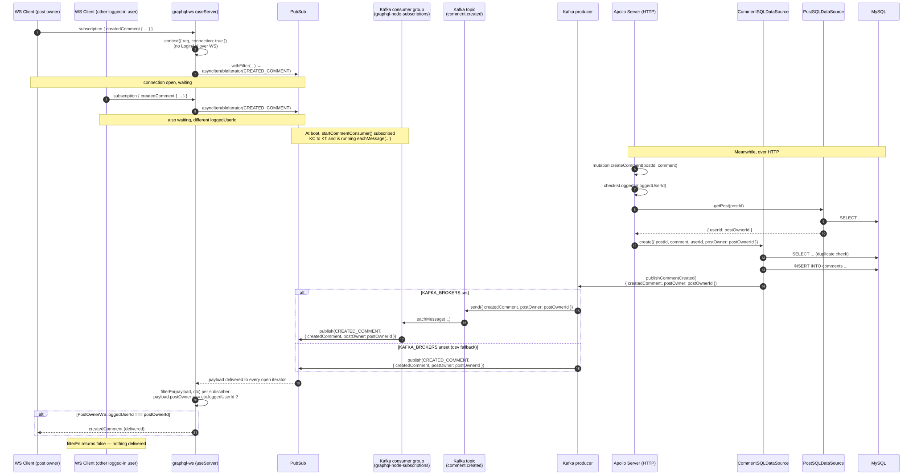

# Real-Time Comments (Subscriptions) Flow

`createdComment` is the one subscription in the schema: it notifies **the
owner of a post** whenever a new comment is created on it — nobody else, not
even the comment's own author.



## Why filtering happens per-subscriber, not at publish time

`pubSub.publish()` broadcasts the same payload to **every** open
`createdComment` iterator, regardless of who's listening. The ownership check
lives entirely in the `filterFn` passed to `withFilter` (see
[`comment/resolvers.ts`](../src/graphql/schema/comment/resolvers.ts)):

```ts
const hasPostOwner = payload?.postOwner !== null && payload?.postOwner !== undefined;
const postOwnerIsLoggedUser = payload?.postOwner === context?.loggedUserId;
```

This means the filtering decision is made **per connected client**, using
*that client's own* `context.loggedUserId` — captured once when the WS
connection's context was built — against the *same* published payload. It's a
clean way to do targeted, per-user delivery without a fan-out of separate
PubSub triggers per user.

## Redis vs. in-memory

In production (`NODE_ENV=production`), `REDIS_URL` is required and
`createPubSub()` returns a `RedisPubSub` — necessary the moment there's more
than one server instance, since an in-memory `EventEmitter`-based `PubSub`
only sees mutations that happen to land on the *same process* as the
WebSocket connection. In development/test, the in-memory fallback avoids
needing a local Redis just to run the app. See
[`pubsub.test.ts`](../src/__tests__/pubsub.test.ts) for both branches,
including the startup failure when production is missing `REDIS_URL`.

## Kafka as an optional event backbone

`CommentSQLDataSource.create()` (see
[`comment/datasources.ts`](../src/graphql/schema/comment/datasources.ts))
doesn't call `pubSub.publish()` itself — it calls `publishCommentCreated()`
from [`src/kafka/producer.ts`](../src/kafka/producer.ts):

- **`KAFKA_BROKERS` set:** the producer sends the event to the
  `comment.created` Kafka topic instead of touching PubSub. A consumer group
  (`graphql-node-subscriptions`, in
  [`src/kafka/consumer.ts`](../src/kafka/consumer.ts)) is started once at
  server boot, subscribed to that topic, and republishes every message onto
  the *same* PubSub the `createdComment` subscription already reads from.
- **`KAFKA_BROKERS` unset:** the producer publishes straight onto PubSub,
  exactly like before Kafka existed — no broker required for local dev.

Either path ends at the same `pubSub.publish(CREATED_COMMENT, ...)` call, so
the subscription resolver and its `withFilter` ownership check are entirely
unaware of which path ran. This is what "Kafka as an event backbone" buys
you here: a durable, replayable log of `comment.created` events that other
consumers (analytics, notifications, a future Kafka Streams job) could tap
into independently, without any of them touching the GraphQL layer — while
the real-time delivery to WS clients keeps using the same Redis/in-memory
PubSub either way.

Run a local broker with `docker compose --profile kafka up -d kafka` and set
`KAFKA_BROKERS` (see [`.env.example`](../.env.example)); see
[`kafka-producer.test.ts`](../src/__tests__/kafka-producer.test.ts) and
[`kafka-consumer.test.ts`](../src/__tests__/kafka-consumer.test.ts) for both
branches under test.

### The consumer retries a cold broker instead of crashing the server

Found by actually starting the app against a **freshly created** Kafka
container (`docker compose --profile kafka up -d --build`, no prior state) —
not just against one that had been running a while. `consumer.subscribe()`
threw `KafkaJSProtocolError: This server does not host this topic-partition`
(`UNKNOWN_TOPIC_OR_PARTITION`) because `comment.created` doesn't exist as a
topic yet the instant the broker comes up, and unlike most KafkaJS request
paths, `subscribe()` doesn't retry that specific error itself even though
KafkaJS marks it `retriable: true`. The error was unhandled, so it crashed
the whole process — on every cold start, 100% reproducible, not a flake —
before `app.listen()` ever ran, taking down GraphQL/health/ready along with
the Kafka feature that actually failed. `restart: always` in
[`docker-compose.yml`](../docker-compose.yml) (and Kubernetes' default pod
restart policy) silently masked this as one extra restart rather than a
startup failure worth noticing.

The fix in [`kafka/consumer.ts`](../src/kafka/consumer.ts):
`subscribeWithRetry()` retries `subscribe()` up to 5 times with backoff
(500ms–8s) before giving up, and the whole connect/subscribe/run sequence is
wrapped in a try/catch that logs rather than throws — Kafka is documented as
optional here, so a consumer that can't attach shouldn't take the rest of
the API down with it. Verified against the same cold-broker scenario after
the fix: the app now reaches `Up ... (healthy)` with **zero** container
restarts, logging one `Kafka subscribe failed, retrying in 500ms` warning
before the topic became available a moment later.
