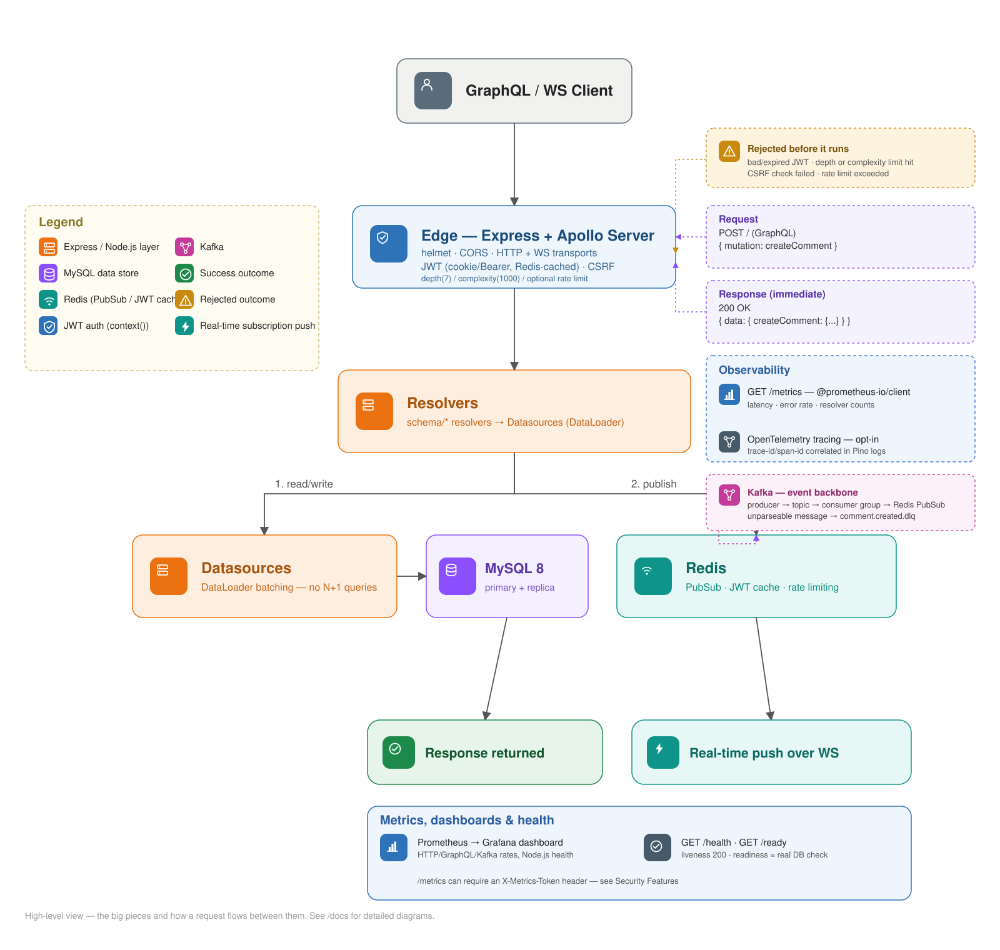
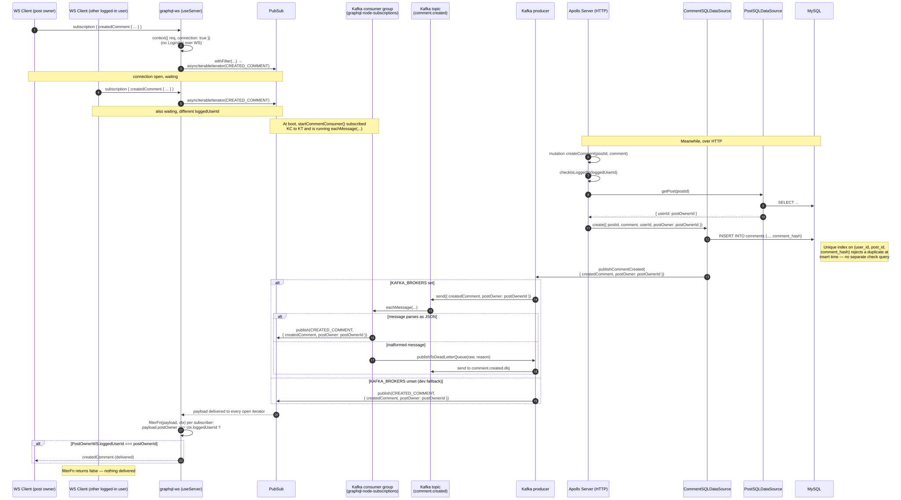
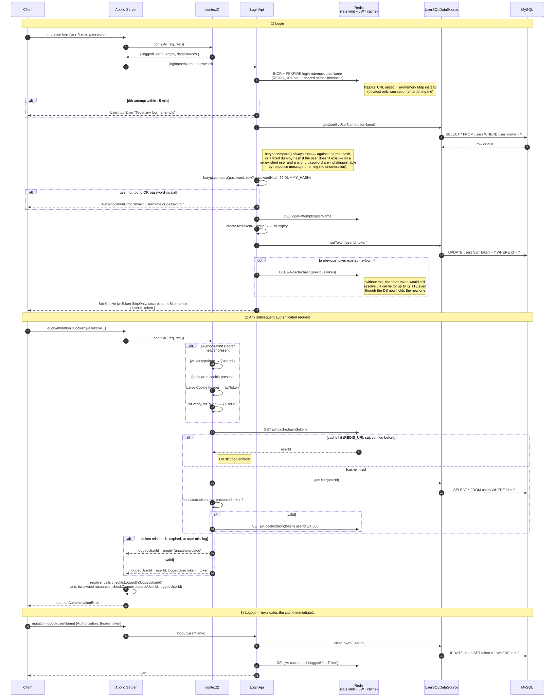

# GraphQL Node Reference Architecture

  

Live GraphQL subscriptions fed by a Kafka event backbone over Redis PubSub, DataLoader batching to kill N+1 queries, and query depth/complexity limits to reject abusive queries before they run — a GraphQL API built with Apollo Server, Knex, and MySQL, with JWT auth via httpOnly cookies.



## Stack

| Layer | Technology |
|---|---|
| Runtime | Node.js 24+ |
| Language | TypeScript (strict mode) |
| GraphQL Server | @apollo/server 5 (Express 5 + graphql-ws) |
| Query Language | GraphQL 16 |
| Database ORM | Knex 3 + MySQL2 |
| Authentication | JWT (jsonwebtoken) + bcrypt |
| Subscriptions | graphql-ws over Redis PubSub (ioredis) · in-memory fallback in dev |
| Event backbone | Kafka (kafkajs) — producer/consumer group feeding PubSub, part of the default stack · degrades to direct PubSub publish if unreachable |
| Observability | Prometheus metrics (`@prometheus-io/client`) + `/health`/`/ready` always on · OpenTelemetry tracing opt-in |
| Logging | Pino (pino-pretty in dev, JSON in prod) — trace-id correlated when tracing is on |
| Transpiler | Sucrase (types are stripped, not checked — see `npm run typecheck`) |
| Testing | Jest + @sucrase/jest-plugin |

## Project Structure

```
src/
├── index.ts                        # Apollo Server entry point
├── utils/
│   └── logger.ts                   # Pino structured logger
├── graphql/
│   ├── context/
│   │   ├── index.ts                # JWT verification, request context
│   │   ├── token-cache.ts          # Redis-backed JWT verification cache
│   │   └── types.ts                # Context / DataSources types
│   ├── pubsub.ts                    # Redis / in-memory PubSub
│   ├── complexity-limit.ts          # Query-complexity plugin (caps total selected fields)
│   ├── format-error.ts              # Masks unclassified errors before they reach the client
│   ├── datasources/sql/            # Base SQLDatasource class (db + readDb connections) + shared DB error helpers
│   └── schema/
│       ├── user/                   # User CRUD + DataLoader
│       ├── post/                   # Post CRUD + DataLoader
│       ├── comment/                # Comment mutations + Subscription
│       ├── login/                  # Login / Logout + Redis-backed rate limiting
│       └── api-filters/            # Pagination/sorting input types
├── kafka/
│   ├── client.ts                    # Kafka instance factory (null if KAFKA_BROKERS unset)
│   ├── producer.ts                  # publishCommentCreated() + publishToDeadLetterQueue()
│   ├── consumer.ts                  # Consumer group → republishes onto PubSub, or the DLQ on a parse failure
│   └── topics.ts                    # Topic name constants (comment.created, comment.created.dlq)
├── observability/
│   ├── metrics.ts                   # Prometheus registry, HTTP + GraphQL + Kafka metrics
│   ├── metrics-auth.ts              # Optional shared-secret gate on /metrics
│   ├── rate-limiter.ts              # Optional global per-IP rate limiter
│   ├── health.ts                    # /health (liveness) and /ready (readiness) handlers
│   ├── tracing.ts                   # OpenTelemetry NodeSDK bootstrap (opt-in, loaded via -r)
│   └── apollo-plugin.ts             # Apollo Server plugin recording GraphQL operation metrics
├── redis.ts                        # General-purpose Redis client (login rate limiting, JWT cache)
└── knex/
    ├── index.ts                    # Knex connection factory (db + optional read replica)
    ├── knexfile.ts                 # DB config per environment
    ├── migrations/                 # Schema migrations
    └── seeds/                      # Development seed data
```

<details>
<summary>Datasource class diagram</summary>



</details>

## Prerequisites

- [Node.js](https://nodejs.org/) v24+
- [Docker](https://www.docker.com/) (for the MySQL, Redis, and Kafka containers — all part of the default `docker compose up` stack; see [Docker](#docker) below)
- Redis is required in production for subscriptions PubSub, login rate limiting, and the JWT verification cache — optional in development
- [k6](https://k6.io/) (optional — for `npm run loadtest`)
- [kind](https://kind.sigs.k8s.io/) + `kubectl` (optional — for trying the [Kubernetes manifests](#kubernetes) locally)

## Getting Started

### 1. Clone and install

```bash
git clone https://github.com/luizcurti/graphql-node-reference-architecture.git
cd graphql-node-reference-architecture
npm install
```

### 2. Configure environment

```bash
cp .env.example .env
# Edit .env and fill in DATABASE_USER, DATABASE_PASSWORD, MYSQL_ROOT_PASSWORD, and JWT_SECRET (min 32 chars)
```

### 3. Start the database

```bash
docker compose up -d
```

### 4. Run migrations and seed data

```bash
npm run db:setup
```

This runs all migrations and populates the database with 20 users, 24 posts, and 24 comments for development.

### 5. Start the development server

```bash
npm run dev
```

The GraphQL Playground will be available at:

```
http://localhost:4003/graphql
```

## Environment Variables

| Variable | Required | Description |
|---|---|---|
| `NODE_ENV` | Yes | `development` or `production` |
| `PORT` | No | Server port (default: `4003`) |
| `JWT_SECRET` | Yes | Secret key — minimum 32 characters |
| `ALLOWED_ORIGINS` | Yes | Comma-separated list of allowed CORS origins |
| `DATABASE_CLIENT` | No | Knex client (default: `mysql2`) |
| `DATABASE_HOST` | Yes | MySQL host |
| `DATABASE_PORT` | Yes | MySQL port (default: `3306`) |
| `DATABASE_NAME` | Yes | Database name |
| `DATABASE_USER` | Yes | Database user |
| `DATABASE_PASSWORD` | Yes | Database password |
| `DATABASE_POOL_MIN` / `DATABASE_POOL_MAX` | No | Knex connection pool size (defaults: `2` / `10`) |
| `DATABASE_REPLICA_HOST` / `DATABASE_REPLICA_PORT` | No | Optional read replica for list/batch queries |
| `MYSQL_ROOT_PASSWORD` | Yes | MySQL root password (Docker only) |
| `REDIS_URL` | Prod only | Redis connection URL — subscriptions, distributed login rate limiting, and the JWT verification cache. A `redis` service is included in `docker-compose.yml`; optional in development |
| `KAFKA_BROKERS` | No | Comma-separated Kafka broker list — set by default in `.env.example`/`docker-compose.yml`; falls back to direct PubSub publish when unset or unreachable |
| `KAFKA_CLIENT_ID` | No | Kafka client id (default: `graphql-node`) |
| `KAFKA_CONSUMER_GROUP` | No | Kafka consumer group id (default: `graphql-node-subscriptions`) |
| `OTEL_EXPORTER_OTLP_ENDPOINT` | No | Enables OpenTelemetry tracing, exported to this OTLP/HTTP collector |
| `OTEL_SERVICE_NAME` | No | Service name reported in traces (default: `graphql-node`) |
| `QUERY_DEPTH_LIMIT` | No | Max GraphQL query nesting (default: `7`) |
| `MAX_QUERY_COMPLEXITY` | No | Max total selected fields per query (default: `1000`) |
| `JSON_BODY_LIMIT` | No | Max size of an incoming JSON request body (default: `100kb`) |
| `RATE_LIMIT_MAX` / `RATE_LIMIT_WINDOW_MS` | No | Global per-IP request rate limit — disabled unless `RATE_LIMIT_MAX` is set above `0` (see [Security Features](#security-features)) |
| `METRICS_TOKEN` | No | If set, `/metrics` requires this value in the `X-Metrics-Token` header |
| `LOG_LEVEL` | No | Pino log level (default: `info`) |

## API

### Queries

```graphql
user(id: ID!): User!                        # requires authentication
users(input: ApiFiltersInput): [User!]!     # requires authentication

post(id: ID!): Post!
posts(input: ApiFiltersInput): [Post!]!     # requires authentication
```

### Mutations

```graphql
# Auth
login(data: LoginInput!): Login!
logout(userName: String!): Boolean!

# Users
createUser(data: CreateUserInput!): User!
updateUser(userId: ID!, data: UpdateUserInput!): User!   # owner only
deleteUser(userId: ID!): Boolean!                        # owner only

# Posts
createPost(data: CreatePostInput!): Post!                # requires authentication
updatePost(postId: ID!, data: UpdatePostInput!): Post!   # owner only
deletePost(postId: ID!): Boolean!                        # owner only

# Comments
createComment(data: CreateCommentInput!): Comment!       # requires authentication
```

### Subscriptions

```graphql
createdComment: Comment!   # notifies the post owner when a comment is created
```

<details>
<summary>Subscription flow (Kafka → PubSub → graphql-ws)</summary>



</details>

### Pagination / Sorting (ApiFiltersInput)

```graphql
input ApiFiltersInput {
  _sort: String
  _order: ApiFilterOrder   # ASC | DESC
  _start: Int
  _limit: Int
}
```

## Authentication

Login sets a `jwtToken` **httpOnly cookie** for browser clients. The same
token is also returned as `token` in the mutation response — needed because
non-browser flows (WebSocket subscriptions, mobile/API clients) can't rely on
the cookie — so a client that only wants cookie-based auth should simply not
select that field:

```graphql
mutation {
  login(data: { userName: "alice_barros38", password: "Senha123" }) {
    userId
  }
}
```

To authenticate via Bearer token (e.g., WebSocket subscriptions):

```
Authorization: Bearer <token>
```

<details>
<summary>Auth flow (login → JWT cookie → per-request verification)</summary>



</details>

## Security Features

- JWT validated on every request against the database token (stateful sessions) — cached in Redis by token hash (5 min TTL) when `REDIS_URL` is set, so a repeat request with the same still-valid token skips the DB lookup; actively invalidated on logout and on the next login (not just left to expire), so revocation isn't delayed by the cache. Falls back to a DB check on every request when Redis is unset or unreachable
- `JWT_SECRET` must be ≥ 32 characters — server exits on startup if invalid
- Query depth (`QUERY_DEPTH_LIMIT`, default **7**) and query complexity (`MAX_QUERY_COMPLEXITY`, default **1000** selected fields) are both bounded — complexity catches wide-but-shallow alias abuse depth limiting misses; `_limit` on paginated lists is separately capped at 100 regardless of what's requested, since neither check accounts for page size
- GraphQL introspection **disabled in production**
- Login rejects a nonexistent username and a wrong password with the same message and timing (a dummy bcrypt comparison runs either way), so a login attempt can't be used to enumerate valid usernames
- Login rate limiting: **5 attempts per 15 minutes** per username — Redis-backed (shared across instances) when `REDIS_URL` is set, in-memory otherwise; fails open (allows the attempt) if Redis itself is unreachable, rather than blocking logins on an unrelated infrastructure outage
- Optional global rate limiting (`RATE_LIMIT_MAX`/`RATE_LIMIT_WINDOW_MS`, off by default) and a request body size cap (`JSON_BODY_LIMIT`, default 100kb)
- `formatError` masks any error outside a known allowlist (auth/validation/CSRF/parse failures) into a generic `INTERNAL_SERVER_ERROR` — a raw DB or driver error never reaches the client; the original is still logged server-side
- [helmet](https://github.com/helmetjs/helmet) security headers on every response, with a Content-Security-Policy that keeps its default directives everywhere and adds a narrow allowlist only for the specific Apollo-hosted origins the dev-only Sandbox landing page embeds (that page is never served when `NODE_ENV=production`)
- `userName` validation uses a linear-time regex, deliberately avoiding nested quantifiers (`(x+)+`-shaped patterns) — that shape is vulnerable to catastrophic backtracking (ReDoS), where a crafted ~30-character input takes seconds to reject and grows exponentially from there, long enough to stall the single-threaded event loop for every request over a slightly longer input
- `/metrics` can be gated behind a shared secret (`METRICS_TOKEN`) so process/runtime details aren't world-readable
- Comment creation is deduplicated by a database-level unique index (`user_id`, `post_id`, a hash of the comment), not a check-then-insert query, so two identical concurrent requests can't both succeed. `userName` uniqueness on signup and rename is enforced the same way — the real unique-constraint violation is caught and turned into a `ValidationError`, rather than a pre-check that two concurrent requests for the same name could both pass
- CSRF prevention enabled (Apollo Server default, set explicitly) — rejects `text/plain` and `application/x-www-form-urlencoded` request forgery; covered in `e2e-test.ts`
- Tokens stored only in `httpOnly + secure` cookies
- All credentials via environment variables (never hardcoded)
- CI scans the full git history for secrets on every push ([gitleaks](https://github.com/gitleaks/gitleaks)), runs [CodeQL](https://codeql.github.com/) static analysis on every push/PR plus a weekly scheduled scan, and Dependabot opens a PR weekly for any dependency with a known vulnerability — `npm audit` (high severity+) fails the build outright

## Available Scripts

```bash
npm run dev              # Start development server with hot reload
npm start                # Start production server (requires build)
npm run build            # Compile src/ to dist/ via Sucrase

npm test                 # Run all tests
npm run test:watch       # Run tests in watch mode
npm run test:integration # Run integration tests against a real MySQL (needs db:setup first)
npm run test:e2e         # Run e2e-test.ts against a running server
npm run test:api         # Run the Postman collection (via `npx newman`) against a running server
npm run loadtest         # Run the k6 load test against a running server (requires k6 installed)
npm run test:ci          # lint:check + typecheck + test + build
npm run typecheck        # Type-check the project with tsc (no emit)

npm run migrate          # Run pending database migrations
npm run migrate:rollback # Roll back the last migration batch
npm run seed             # Populate database with development seed data
npm run db:setup         # migrate + seed in one command

npm run lint             # Run ESLint
npm run lint:fix         # Auto-fix ESLint issues
npm run format           # Format code with Prettier
npm run format:check     # Check formatting without writing

npm run security         # Run npm audit (high severity)
```

## Testing

Four independent layers, each covering the API from a different angle:

```bash
npm test                 # unit tests — mocked, no external services needed
npm run test:integration  # real MySQL — schema, constraints, cascades
npm run test:e2e          # black-box HTTP run against a live server
npm run test:api          # Postman collection (via newman) against a live server
```

### Unit tests (`npm test`)

265 tests across 28 suites, with **100% statement/branch/function/line
coverage** across every module Jest collects coverage for (resolvers,
datasources, auth context, pubsub, kafka, knex config, observability,
validators — see `npm test -- --coverage`). Entry-point bootstrap
(`src/index.ts`) and migrations/seeds aren't imported by any unit test, so
Jest's default coverage collection never touches them. GraphQL error
masking, the `/metrics` auth gate, and the global rate limiter each live in
their own module under `src/graphql/`/`src/observability/` specifically so
they're unit testable on their own; only the composition itself (wiring
middleware together, binding a port, signal handling) is left uncovered by
unit tests, and that part is exercised by the e2e/API suites instead,
against a real running server.

- `login-functions` — `checkIsLoggedIn`, `checkOwner`
- `user-validators` — `validateUserName`, `validateUserPassword`
- `user-resolvers` / `post-resolvers` / `comment-resolvers` — all Query, Mutation, field resolvers, and the real subscription filter (via `withFilter` + pubsub)
- `login-api` — full login/logout flow (including the identical-message/timing treatment for a nonexistent user vs. a wrong password), rate limiting (in-memory fallback, the Redis-backed path, and failing open when Redis itself is unreachable), invalidating the JWT cache on logout and on the next login, cookie behavior
- `user-datasource` / `post-datasource` / `comment-datasource` — reducers, whitelist validation, create/update/delete, `index_ref` assigned from the new row's own id (not a separate `MAX()` query), the `_limit` page-size clamp, DataLoader batch functions, the DB-level duplicate rejection for both a taken `userName` and a duplicate comment (a real unique-constraint violation caught and translated to a `ValidationError`, not a check-then-write query), publishing to the Kafka producer on comment creation, and read-replica routing (which methods use `readDb` vs. `db`)
- `context` — every branch of JWT/cookie authentication, including the Redis cache hit/miss paths
- `token-cache` — reading, writing, and invalidating the cached (token → userId) mapping, and failing safely (falls back to a DB check) when Redis errors
- `kafka-client` / `kafka-producer` / `kafka-consumer` — Kafka-configured vs. unconfigured branches, connect-once memoization (including retrying after a failed connection attempt), malformed-message handling, and republishing an unparseable message to the dead-letter queue
- `format-error` — every safe error code passes through unchanged; anything else (including no code at all) is masked and logged
- `observability-metrics` / `observability-metrics-auth` / `observability-rate-limiter` / `observability-health` / `observability-apollo-plugin` / `observability-tracing` — HTTP/GraphQL/Kafka metric recording, the `/metrics` shared-secret gate (open/correct/missing/wrong-length), the rate limiter's on/off/env-driven config, liveness always-200, readiness happy/DB-down paths, and OTel SDK start/shutdown with tracing enabled/disabled
- `redis` — the same optional-additive pattern as `kafka-client`, applied to the general-purpose Redis client
- `complexity-limit` — under budget, over budget (many aliases, low depth), the required-variable case, and the `MAX_QUERY_COMPLEXITY` env override
- `pubsub`, `sql-datasource`, `schema-index`, `logger`, `knex-config` — supporting modules (env-dependent branches, base class behavior, module wiring, read-replica connection building, trace-id log mixin, closing both DB pools on shutdown)

### Integration tests (`npm run test:integration`)

27 tests against a real MySQL database (requires `npm run db:setup` first).
These exist specifically for what can't be meaningfully faked with mocks:
unique-constraint violations (including the DB-level duplicate-comment
index), and `ON DELETE CASCADE` actually deleting a user's posts and a
post's comments.

### End-to-end tests (`npm run test:e2e`)

36 checks that run real GraphQL requests against a running server — the
same happy-path and rejected-without-auth scenarios a real client would
hit, plus checks that need a real running server rather than a mocked
resolver: two CSRF-prevention checks against raw non-JSON content types, a
duplicate-comment rejection, proof that a nonexistent-user and a
wrong-password login return the exact same error message, helmet security
headers, and reachability of `/health`, `/ready`, and `/metrics`.

### API / collection tests (`npm run test:api`)

Runs [`graphql-node.postman_collection.json`](./graphql-node.postman_collection.json)
headlessly via [Newman](https://github.com/postmanlabs/newman) (invoked with
`npx`, not a project dependency — its dependency tree carries known
vulnerabilities in transitive packages, so it's kept out of `package-lock.json`
and this project's own `npm audit`). Covers logins, ownership checks,
validation errors, SQL-injection/depth-limit/complexity-limit rejection,
security headers, and login rate limiting — 69 assertions across 34
requests.

Like `test:e2e`, it expects a running server with freshly seeded data
(`npm run db:setup`); running it twice in a row without reseeding will fail
on requests that assert uniqueness (e.g. duplicate comment detection), since
the first run's data is still there.

### Load tests (`npm run loadtest`)

A separate exercise from the four correctness layers above — concurrent
load via [k6](https://k6.io/), checking not just that reads stay fast under
load but that auth rejection, the query depth limit, and duplicate-comment
detection all keep working correctly while the server is busy, not just
when idle.

The full run above isn't wired into CI (it's a performance benchmark, not a
correctness gate — run it manually before a release or when touching the
hot paths it covers). CI does run a `SMOKE_TEST=true` variant of the same
script after the `integration` job's e2e/API tests (3 seconds per scenario,
thresholds still enforced) purely so a broken query or schema change in the
script itself fails fast, instead of only being discovered the next time
someone runs the real benchmark by hand.

The global rate limiter (`RATE_LIMIT_MAX`, see [Security
Features](#security-features)) is off by default specifically so it doesn't
interfere with this — if you've turned it on in your `.env`, unset it (or
raise the limit well above the load test's request rate) before running the
full benchmark.

### Stress test (`npm run stresstest`)

[`loadtest/stress-test.js`](./loadtest/stress-test.js) is a separate, much
heavier script: 3000 concurrent virtual users for 60 seconds, all starting
at once rather than ramped, split across the same three traffic shapes as
`loadtest` (40% reads, 40% writes, 20% deliberately-bad requests), plus a
1-VU `/health` probe running the whole time as an independent "did the
process crash" signal. Like `loadtest`, it isn't wired into CI — run it
manually (`npm run stresstest`, or `STRESS_VUS=300 STRESS_DURATION=15s npm
run stresstest` to shake the script out at a smaller scale first).

At this concurrency `DATABASE_POOL_MAX` (default `10`) is the real
bottleneck, not the app code, so this test doesn't assert an error-rate SLA
on the DB-touching paths — it asserts the server keeps *behaving correctly*
under saturation instead of falling over. Verified against a real `docker
compose` stack on a 10-core machine:

| Metric | Result |
|---|---|
| Server crashed? | No — `/health` returned 200 for 100% of probes throughout |
| Unexpected errors on reads/writes | ~2–3% (mostly requests that didn't complete within the script's 15s per-request timeout) |
| "No auth header" correctly rejected | 96–99% — this check runs in `checkIsLoggedIn()` before any DB call, so it kept working even while every DB-touching request was queued behind the pool |
| Depth-limit rejection correctly rejected | 100% — rejected during GraphQL validation, before a resolver or the DB is ever reached |
| Duplicate-comment rejection correctly rejected | 100% — this one *does* need a DB write, and still held |
| Throughput | ~700–720 req/s sustained across 47–48k requests |
| Latency under saturation | avg ~3.7s, p95 ~6.9s (vs. low tens of ms at the concurrency `loadtest` above exercises) — this is queueing delay behind 10 DB connections serving thousands of concurrent callers, not failures |

The app degrades by queueing and slowing down, not by crashing or
returning corrupted/leaked responses — and the two rejection paths that
don't depend on acquiring a DB connection (auth, depth limit) stay correct
almost perfectly even at 300x the pool size in concurrent callers. If you
need to actually serve this level of concurrency rather than just survive
a burst of it, `DATABASE_POOL_MAX` is the lever to raise (or route reads
to the [read replica](./k8s/README.md#read-replica) in Kubernetes).

Container memory rises to roughly 700MiB–1GiB during the run and holds
there for about a minute after load stops, then a V8 major GC cycle drops
it back to the pre-test baseline (~110–130MiB) — consistent across
repeated runs of this same test, not a one-off. Transient heap growth from
tens of thousands of in-flight requests/promises during the burst, not
retained memory.

### HPA scaling vs. this bottleneck

The [Kubernetes HPA](#kubernetes) scales the app from 2 to 6 pods under
CPU load — verified working in `k8s/README.md`. But every pod still opens
its own `DATABASE_POOL_MAX` (10) connections against the *same* single
MySQL primary. This stress test's finding applies just as much there: past
a certain request rate, MySQL's total connection budget is the ceiling,
not the number of app pods serving requests. Scaling app replicas helps
with CPU-bound work (and the HPA is CPU-based) but doesn't raise that
ceiling.

[`k8s/mysql-replica.yaml`](./k8s/mysql-replica.yaml) addresses the read
half of this — a real GTID-replicated MySQL instance that
`DATABASE_REPLICA_HOST` routes list/browse queries and DataLoader batch
reads to instead of the primary (see [Kubernetes](#kubernetes) and
`k8s/README.md`'s [Read replica](./k8s/README.md#read-replica) section for
how it's verified). Writes still funnel through the one primary regardless;
raising `DATABASE_POOL_MAX` (bounded by MySQL's own `max_connections`) is
the remaining lever for that side, and this project has no sharding or
multi-primary setup.

## Database

<details>
<summary>Data model (users → posts → comments, cascade deletes)</summary>



</details>

<details>
<summary>Read/write routing across the primary and optional read replica</summary>


</details>

### Migrations

```bash
npm run migrate          # apply all pending migrations
npm run migrate:rollback # roll back last batch
```

Migrations in `src/knex/migrations/`:

| File | Description |
|---|---|
| `20210529121742_create-comments-table.ts` | Comments table (integer post_id / user_id) |
| `20260310130000_create-users-table.ts` | Users table with unique user_name |
| `20260310130001_create-posts-table.ts` | Posts table with FK → users (CASCADE DELETE) |
| `20260310130002_add-fk-to-comments.ts` | FK constraints on comments → posts and users (CASCADE DELETE) |

### Seeds

```bash
npm run seed             # truncate and repopulate all tables
```

Seed data (`src/knex/seeds/`):

| File | Records |
|---|---|
| `01_users.ts` | 20 users — all with password `Senha123` |
| `02_posts.ts` | 24 posts |
| `03_comments.ts` | 24 comments |

Seeds run in order and respect foreign key constraints.

## Docker

Run the whole stack — API + MySQL + Redis + Kafka — with Docker Compose. The
app image is built from the root `Dockerfile` (multi-stage: Sucrase build,
then a slim production image with only `dist/` and production dependencies).

```bash
cp .env.example .env   # fill in the values, same as local development
docker compose up -d --build
npm run db:setup       # migrate + seed, run from the host against the containerized DB
```

The API is then available at `http://localhost:4003/graphql`, same as
`npm run dev`. Redis and Kafka come up by default alongside MySQL (not
behind a profile like observability below) — Redis backs subscriptions, the
distributed login rate limiter, and the JWT cache in a real deployment (set
`REDIS_URL=redis://redis:6379` in `.env` to actually use it; it's optional
in development, so nothing requires this). Kafka backs the `comment.created`
event backbone described below.

To run only the MySQL container (e.g. while running the API locally via
`npm run dev`):

```bash
docker compose up -d graphql_mysql
```

### Kafka

The broker is part of the default stack, no profile needed.
`KAFKA_BROKERS=localhost:9092` in `.env.example` is for the app running on
the host (`npm run dev`, `npm run test:integration`) against the broker's
published port; `docker-compose.yml` overrides this to `kafka:19092` for
the containerized app itself (same pattern as `DATABASE_HOST`), since only
the containerized app is inside the Compose network where the `kafka`
hostname resolves.
Without `KAFKA_BROKERS` — or if the broker is unreachable —
`createComment` publishes straight onto PubSub instead, so subscriptions
work identically either way. The consumer retries a topic that isn't
available yet on a freshly started broker instead of crashing the server,
and the producer retries its own connection on the next publish if the
first `connect()` attempt fails, instead of staying broken for the life of
the process.

A message the consumer can't parse is republished onto `comment.created.dlq`
(with the original payload, the parse error, and a timestamp) instead of
being silently dropped — the consumer offset still advances past it either
way, so without a DLQ that message would be gone for good. Verified
directly: producing a malformed message onto `comment.created` lands it,
with reason and payload, on `comment.created.dlq`.

### Observability

```
http://localhost:4003/health   # liveness — always 200
http://localhost:4003/ready    # readiness — 200/503 based on a real DB check
http://localhost:4003/metrics  # Prometheus exposition format
```

Tracing is opt-in — bring up a local collector and point the app at it:

```bash
docker compose --profile observability up -d jaeger
# .env: OTEL_EXPORTER_OTLP_ENDPOINT=http://localhost:4318
```

Jaeger's UI is then at `http://localhost:16686`.

Metrics visualization (Prometheus + Grafana) is on the same profile,
pre-wired end to end — a Prometheus scraping the app's `/metrics` (config
in [`monitoring/prometheus`](./monitoring/prometheus)) feeding a
pre-provisioned Grafana dashboard (["GraphQL Node —
Overview"](./monitoring/grafana/provisioning/dashboards/json/graphql-node-overview.json),
config in [`monitoring/grafana`](./monitoring/grafana)): HTTP/GraphQL
request rate and latency percentiles, Kafka produce/consume rate (empty
unless `KAFKA_BROKERS` is set), and Node.js process health (heap, event
loop lag, CPU, RSS):

```bash
docker compose --profile observability up -d prometheus grafana
```

Prometheus at `http://localhost:9090` (check **Status → Targets** — the
`graphql-node` job should show `UP`), Grafana at `http://localhost:3000`
(anonymous viewer access enabled for this local/throwaway stack — no
login needed; the dashboard opens directly). Verified end to end against a
real run: Prometheus scraping successfully, the dashboard provisioned with
all 9 panels, and every panel's query returning real data after a handful
of requests.

<details>
<summary>Request → metrics/traces/logs flow</summary>



</details>

## Kubernetes

Plain Deployment/Service/ConfigMap/Secret/HPA manifests in
[`k8s/`](./k8s/) — no Helm/Kustomize, verified against a real
[kind](https://kind.sigs.k8s.io/) cluster. `REDIS_URL` is required in
production — `NODE_ENV=production` enforces it, which is also why login
rate limiting is Redis-backed. MySQL runs as a real primary + read replica
pair (GTID replication, `DATABASE_REPLICA_HOST` wired up by default) — see
[Read replica](./k8s/README.md#read-replica) for how that's verified.
Kafka (`k8s/kafka.yaml`) is part of the default manifest set too —
`KAFKA_BROKERS` in `configmap.yaml` points the app at it, and a
`createComment` served by one app replica is verified to be consumed via
Kafka by a *different* replica, the actual reason to run it as a separate
broker instead of just publishing straight onto each pod's own PubSub
connection. The same [k6 load test](#load-tests-npm-run-loadtest)
used against Docker Compose doubles as an HPA load test here — point it at
the port-forwarded Service instead of `localhost:4003` (see [`k8s/README.md`](./k8s/README.md)
for the full walkthrough, including a verified run that scales the
Deployment from 2 to 3 replicas under load).

<details>
<summary>Deployment topology (Docker Compose / Kubernetes)</summary>



</details>

## CI

[`.github/workflows/ci.yml`](./.github/workflows/ci.yml) runs on every push
and pull request to `main`, as five jobs:

| Job | Runs |
|---|---|
| `secrets-scan` | [gitleaks](https://github.com/gitleaks/gitleaks) scans the full git history (not just the working tree) for committed secrets |
| `quality` | Install → ESLint → Prettier check → typecheck → unit tests → build → `npm audit` (fails the build on any high/critical finding) → outdated-dependency check |
| `integration` | Migrate + seed a real MySQL service container → integration tests → build → start the server → e2e tests → API/collection tests → k6 smoke test (`SMOKE_TEST=true`) |
| `k8s-lint` | [kubeconform](https://github.com/yannh/kubeconform) validates every manifest in `k8s/` against the Kubernetes 1.32 schema — no cluster needed |
| `docker` | Build the app image → `docker compose up` (app + MySQL + Redis + Kafka) → migrate + seed against the containerized DB → e2e tests → API/collection tests, all against the running containers |

[`.github/workflows/codeql.yml`](./.github/workflows/codeql.yml) runs
[CodeQL](https://codeql.github.com/) static analysis separately, on every
push/PR to `main` plus a weekly scheduled scan (so a newly-disclosed
vulnerable pattern in unchanged code still gets caught).

[`.github/dependabot.yml`](./.github/dependabot.yml) runs separately from
both workflows — weekly PRs for npm, Docker base image, and GitHub Actions
updates.

Any job failing fails the whole workflow. `quality` must pass before `docker`
starts, so a broken build or lint error fails fast without spending time on
the Docker build.